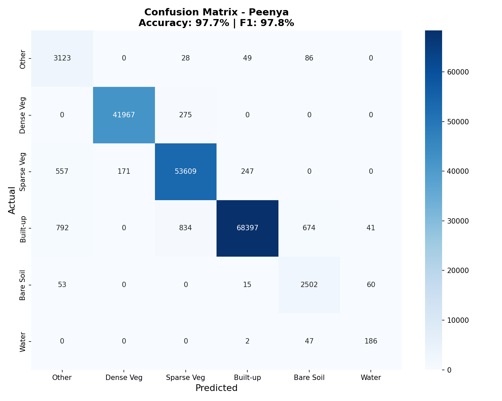

# Industrial Environmental Compliance Monitoring System

**ML Course Project — Statement 3 | IIIT Dharwad**

An automated pipeline for detecting green cover loss and unauthorized construction in industrial zones using multi-temporal Sentinel-2 satellite imagery, spectral analysis, and machine learning.

---

## Results Summary

| Zone | Green Cover 2020 | Green Cover 2024 | Change | Risk Level |
|------|:----------------:|:----------------:|:------:|:----------:|
| **Peenya** | 55.7% | 33.1% | -22.6% | MEDIUM |
| **Whitefield** | 71.2% | 43.5% | -27.8% | MEDIUM |

| ML Model | Peenya | Whitefield |
|----------|:------:|:----------:|
| Accuracy | 97.74% | 98.70% |
| F1-Score | 97.83% | 98.73% |

## Sample Outputs

| Before/After Analysis | Change Detection | Confusion Matrix |
|:---------------------:|:----------------:|:----------------:|
|  |  |  |

---

## Pipeline Architecture

```
download_data.py          # Sentinel-2 L2A acquisition via STAC API
        |
run_pipeline.py            # Orchestrator (runs stages 1-4)
        |
  src/preprocess.py        # Cloud masking, band resampling, stacking
        |
  src/indices.py           # NDVI, NDBI, NBI spectral index computation
        |
  src/change_detection.py  # Bitemporal differencing, risk scoring
        |
  src/ml_classifier.py     # Random Forest + K-Means classification
        |
  src/visualize.py         # Map and chart generation
        |
generate_results.py        # All result images + HTML compliance reports
```

## Features

- **Data Acquisition**: Programmatic Sentinel-2 L2A retrieval via Microsoft Planetary Computer (STAC API)
- **Preprocessing**: Cloud masking (SCL), atmospheric correction (L2A), 20m→10m resampling
- **Spectral Analysis**: NDVI (vegetation), NDBI (built-up), NBI (new construction)
- **ML Classification**: Random Forest (100 trees) trained on 6 spectral bands with 70/30 validation
- **Unsupervised Clustering**: K-Means (k=5) for comparison
- **Change Detection**: Bitemporal NDVI/NDBI differencing with adaptive thresholds
- **Violation Extraction**: Connected component analysis with geo-coordinates (lat/lon)
- **Compliance Reports**: Auto-generated HTML reports with risk assessment and violation alerts
- **Visualizations**: Confusion matrices, learning curves, feature importance, annotated satellite imagery

## Dataset

- **Source**: Sentinel-2 L2A (ESA Copernicus) via Microsoft Planetary Computer
- **Resolution**: 10m (B02-B08), 20m resampled to 10m (B11-B12)
- **Zones**: Peenya Industrial Area, Whitefield (Bengaluru, Karnataka)
- **Time Periods**: March 2020 (baseline) vs March 2024 (recent)
- **Total Data Points**: ~11.6 million multispectral pixels
- **Bands**: B02 (Blue), B03 (Green), B04 (Red), B08 (NIR), B11 (SWIR1), B12 (SWIR2), SCL

## Setup & Installation

```bash
pip install -r requirements.txt
```

## Usage

```bash
# Step 1: Download satellite data
python download_data.py

# Step 2: Run full ML pipeline (preprocess → indices → change detection → visuals)
python run_pipeline.py

# Step 3: Train ML models + validation
python -m src.ml_classifier

# Step 4: Generate all result images + compliance reports
python generate_results.py
```

## Project Structure

```
├── download_data.py           # Data acquisition script
├── run_pipeline.py            # Main pipeline orchestrator
├── generate_results.py        # Result visualization generator
├── requirements.txt           # Python dependencies
├── src/
│   ├── __init__.py
│   ├── preprocess.py          # Band stacking, cloud masking, resampling
│   ├── indices.py             # NDVI, NDBI, NBI computation
│   ├── change_detection.py    # Bitemporal change analysis
│   ├── ml_classifier.py       # Random Forest + K-Means + validation
│   └── visualize.py           # Visualization generation
├── data/
│   ├── raw/                   # Raw Sentinel-2 band GeoTIFFs
│   ├── boundaries/            # Industrial zone GeoJSON boundaries
│   └── processed/             # Stacked bands, indices, change maps
├── models/                    # Trained RF models (.joblib) + metrics
├── results/                   # All result images (12 PNGs)
├── reports/                   # HTML compliance reports
└── frontend/
    └── assets/                # Additional visualizations
```

## Technologies

- Python 3.9+
- Rasterio, GDAL (geospatial I/O)
- Scikit-learn (Random Forest, K-Means)
- NumPy, SciPy (numerical computing)
- Matplotlib, Seaborn (visualization)
- PySTAC, Planetary Computer (STAC API)
- GeoPandas, PyProj (spatial operations)

## License

Academic use — IIIT Dharwad ML Course Project
